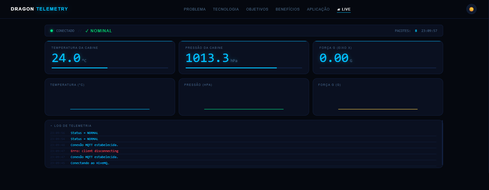
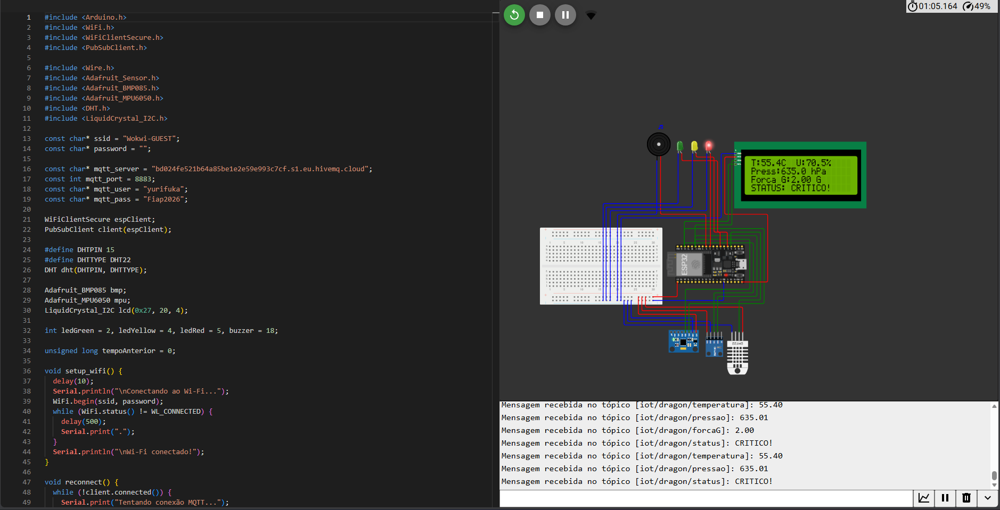
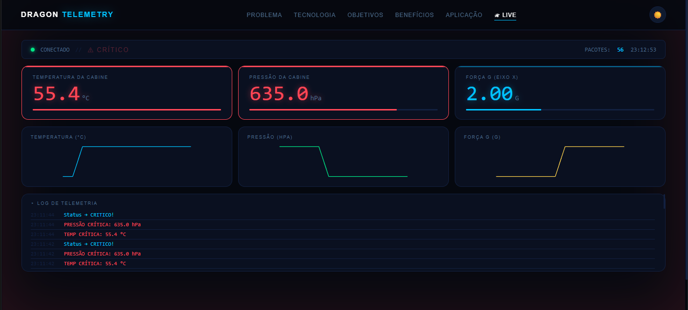

# Dragon Telemetry 

## Integrantes

| Nome | RM |
| Yuri Fukamachi     | 567314 |
| Michel Benchimol   | 567345 |
| André Rosa         | 567149 |

**Turma:** 1ESPR 
> **FIAP · Engenharia de Software · 1º Ano · Global Solution 2026**  
> **Disciplina:** Web Development

## Resumo do Projeto

Aplicação React que serve como vitrine e dashboard para o sistema de telemetria da **Cápsula Dragon da SpaceX**. Conecta ao broker HiveMQ via MQTT/WebSocket para exibir dados de sensores em tempo real, com gráficos históricos e sistema de alertas visuais.

Para a avaliação de Edge Computing e Computer Systems a aplicação se encontra na aba "Live"

## Estrutura

```
src/
├── components/
│   ├── Navbar.jsx / .module.css   ← Navegação com React Router
│   ├── Footer.jsx / .module.css   ← Rodapé padrão
│   ├── Card.jsx   / .module.css   ← Card reutilizável
│   └── SensorCard.jsx / .module.css ← Card de sensor com dados do JSON
├── pages/
│   ├── Problema.jsx       ← ODS, riscos, estatísticas
│   ├── Tecnologia.jsx     ← Arquitetura, sensores, tópicos MQTT
│   ├── Objetivos.jsx      ← Timeline com progress bars animadas
│   ├── Beneficios.jsx     ← Métricas, equipe, quote
│   ├── Aplicacao.jsx      ← Passo a passo + FAQ accordion
│   └── Telemetria.jsx     ← Dashboard live MQTT em tempo real
├── data/
│   └── dados.json         ← JSON local com todos os dados do projeto
├── App.jsx                ← Router + ThemeContext
├── main.jsx
└── index.css
```

## Critérios de Avaliação Atendidos

| Critério | Implementação |
| **Cards com dados da ideia** | `SensorCard` renderiza dados do `dados.json` |
| **JSON local** | `src/data/dados.json` — sensores, alertas, equipe, FAQ |
| **React Router DOM** | 6 rotas: `/`, `/tecnologia`, `/objetivos`, `/beneficios`, `/aplicacao`, `/telemetria` |
| **Componentes reutilizáveis** | `Navbar`, `Footer`, `Card`, `SensorCard` |
| **Dark/Light mode** | `ThemeContext` + `data-theme` CSS vars |
| **Responsividade** | CSS Modules com breakpoints mobile-first |
| **MQTT em tempo real** | Página `/telemetria` conecta ao HiveMQ via WSS |

## Instalação e Execução

```bash
# Instalar dependências
npm install

# Rodar em desenvolvimento
npm run dev
# Acesse: http://localhost:5173

# Build para produção
npm run build
```
## Fotos

case 1 



case 2 (dados alterados)



## Links

| Recurso | Link |
| Repositório | `https://github.com/yurifukamachi07-beep/GS-EC2bim.git` |
| Wokwi | `https://wokwi.com/projects/465041969564807169` |
| StoryTelling | `https://youtu.be/QKYPPo92gOw` |

